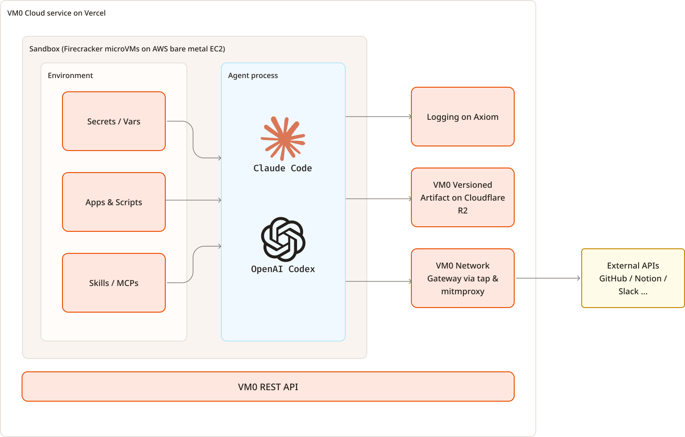

<h2 align="center">
  <a href="https://vm0.ai"></a>
  <br>
  <br>
  Natural language Agent, 24/7 in cloud sandbox
  <br
  <br>
  <p>
    <a href="https://deepwiki.com/vm0-ai/vm0"></a>
    <a href="https://npmjs.com/@vm0/cli"></a>
    <a href="https://vm0.productlane.com"></a>
    <a href="https://github.com/vm0-ai/vm0/actions/workflows/turbo.yml?query=event%3Apush+branch%3Amain"></a>
    <a href="https://codecov.io/gh/vm0-ai/vm0" > 
       
    </a>
  </p>
  <a href="https://trendshift.io/repositories/19748" target="_blank"></a>
</h2>

[Website](https://www.vm0.ai) / [Discord](https://discord.gg/WMpAmHFfp6)

`VM0` runs natural language-described workflows automatically on schedule in remote sandbox environments.

⭐ Star us on GitHub, it motivates us a lot! ⭐

---

## 🔥 What you GET

- **Just Claude Code**, zero abstraction, nothing new to learn
- **Cloud sandbox**, run Claude Code in isolated claude sandbox 24/7
- **Skill Native**, Compatible with 35,738+ skills in [skills.sh](https://skills.sh), and 70+ high quality SaaS integration skill like GitHub, Slack, Notion, Firecrawl, and [more](https://github.com/vm0-ai/vm0-skills), 
- **Persistence**, continue chat, resume, fork, and version your workflow sessions
- **Observability**, logs, metrics, and network visibility for every run

## 🚀 Quick Start

From zero to workflow agent in 5 minutes

```bash
npm install -g @vm0/cli && vm0 init
```

## 📚 Architecture

<p align="center">
  <a href="./docs/architecture.md">
    
  </a>
</p>

- **[Architecture Documentation](./docs/architecture.md)** - Comprehensive technical reference covering sandbox technologies (Firecracker microVMs), infrastructure components and network architecture

For user-facing guides and tutorials, see the [architecture documentation](./docs/architecture.md).

## 📊 Coverage

<p align="center">
  <a href="https://codecov.io/gh/vm0-ai/vm0">
    
  </a>
</p>

## 🤝 Contribute

<p><a href="https://github.com/vm0-ai/vm0/blob/main/CONTRIBUTING.md">
  
</a></p>


## 📃 License

See [LICENSE](./LICENSE) for details.
